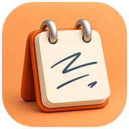

<p align="center">
  
</p>

<h1 align="center">Steno</h1>

A macOS menu bar app that records your meetings, transcribes them **on your Mac** and writes the Transcript and a Summary into your **Obsidian** vault. You choose who writes the Summary: a model running locally, or any OpenAI-compatible provider you trust (for example one hosted in the EU).

It was built as an alternative to Granola for people whose company does not allow meeting audio and text to leave the EU.

- **Records both sides of a call**: your microphone and the system audio (Meet, Zoom, Teams, any app), with echo cancellation.
- **Transcribes locally** with Whisper ([WhisperKit](https://github.com/argmaxinc/WhisperKit)): the audio never leaves the Mac. Choose between Whisper Large v3 Turbo (default), its full version, Small and NVIDIA Parakeet v3 in *Settings → Transcription*.
- **Summarises with a provider you pick**: llama.cpp, Ollama or LM Studio on your Mac, or a remote OpenAI-compatible API. You can also skip the Summary and keep only the Transcript.
- **Writes Markdown into Obsidian**: one note per meeting, opened when the meeting starts so you can take notes, plus a separate Transcript file. Your own notes are kept and used to steer the Summary.
- **Templates are notes in your vault**: write the structure and instructions of the Summary in Obsidian.

## Requirements

- A Mac with Apple Silicon and macOS 15 or later
- An Obsidian vault (any folder works, Obsidian is only needed to open the notes)
- About 650 MB of disk for the transcription model, downloaded on first use

Meetings can be in Italian or English, one language per meeting; the Summary can be written in any language.

## Install

### Download

1. Download the zip of the latest version from [Releases](https://github.com/mameli/steno/releases), open it and move **Steno** to **Applications**.
2. Open Steno. macOS says it cannot verify the app: Steno is signed, but not notarized by Apple, which needs a paid developer account. Press **Done**.
3. Go to **System Settings → Privacy & Security**, scroll down and press **Open Anyway** next to Steno, then confirm with your password. Alternatively, run `xattr -dr com.apple.quarantine /Applications/Steno.app` in Terminal before opening it.

Do this again for every new version you download. On Macs managed by your company, IT may not allow apps that are not notarized.

### Build from source

1. Install Xcode 16 or later from the App Store and open it once.
2. Clone the repository:
   ```sh
   git clone https://github.com/mameli/steno.git
   cd steno
   ```
3. Choose how to sign it (see [Signing](#signing)) and copy `Config/Local.xcconfig.example` to `Config/Local.xcconfig`.
4. Build and copy it to Applications:
   ```sh
   xcodebuild -project Steno.xcodeproj -scheme Steno -configuration Release -derivedDataPath build/DerivedData build
   cp -R build/DerivedData/Build/Products/Release/Steno.app /Applications/
   open /Applications/Steno.app
   ```

### Signing

macOS ties the microphone and system audio permissions to the app's signature: with a stable signature they are asked once, otherwise again after every build. Two free options:

- **A self-signed certificate.** Keychain Access → Certificate Assistant → Create a Certificate…: name `Steno`, Identity Type *Self-Signed Root*, Certificate Type *Code Signing*; tick *Let me override defaults* and set a validity of 3650 days. Then double-click the certificate, and under *Trust* set *Code Signing* to *Always Trust*. The first build asks to use the key: choose *Always Allow*.
- **Your Apple ID's free Personal Team.** Add your Apple ID in Xcode → Settings → Accounts, then in `Config/Local.xcconfig` use the second option with your Team ID.

Without `Config/Local.xcconfig` the app is signed ad hoc and the permissions are asked again after every build.

## First setup

1. **Permissions.** On the first meeting macOS asks for the microphone and for *System Audio Recording Only*: allow both.
   During that first meeting Steno also downloads the transcription model and prepares it, which takes a few minutes once: the menu shows the progress, and the first Summary waits for it.
2. **Vault.** Steno menu → *Settings…* → *Obsidian Vault* → choose your vault folder. Steno creates `Meetings/_Templates/` with a default *Notes* Template; `Meetings/` and `Meetings/Transcripts/` fill up with the first meeting.
3. **Open at login** (optional). *Settings → General*: Steno starts with the Mac, in the menu bar. Turn it on from the copy in `/Applications`, the one you will keep using.
4. **Summary Profile.** In *Summary Profiles* add a Profile: name, base URL, model, max context and, if the provider needs one, the API key (stored in the macOS Keychain). Press *Test connection*. Some examples:

   | Provider | Base URL | Model | Key |
   |---|---|---|---|
   | llama.cpp on your Mac (`llama-server -hf ggml-org/gemma-4-E4B-it-GGUF:Q4_0 -c 32768`) | `http://localhost:8080/v1` | `ggml-org/gemma-4-E4B-it-GGUF:Q4_0` | none |
   | [Regolo.ai](https://regolo.ai) (Italy) | `https://api.regolo.ai/v1` | `gemma4-31b` | yes |
   | [Mistral](https://console.mistral.ai) (France) | `https://api.mistral.ai/v1` | `mistral-medium-latest` | yes |

   Set *max context* to the model's real limit (for a local server, the `-c` it was started with). Plain `http://` is accepted only for servers on your Mac.

   Steno does not check where a provider processes your data: check the provider's terms, and your company's policy, before using it for real meetings.

## Use

- **Start and stop** a meeting from the menu bar or with **⌃⌥⌘R** from any app. While recording the icon is a red dot and the menu shows the duration.
- The meeting note opens in Obsidian: write your own notes under **Personal notes**. Steno never touches them.
- After the stop Steno finishes the transcription, writes the Summary at the top of the note, links the Transcript and renames the note with a short title. A notification tells you when it is ready.
- **Template** and **Summary Profile** are chosen in the menu. Choose *Transcript* as Profile to get only the Transcript, with no Summary.
- **Recent meetings → Retry** redoes a meeting with the Template and Profile currently selected: use it after an error, or to get a Summary with another Template.

### Templates

A Template is a note in `Meetings/_Templates/`: its text tells the model what to write and how. Create one from *Settings → Templates*, then edit it in Obsidian. Add `summary_language: en` (or `it`, `fr`, …) to its frontmatter to always get the Summary in that language; otherwise it follows the language of the meeting.

### Where your data is

- **Notes and Transcripts**: in your vault, as plain Markdown.
- **Audio**: in `~/Library/Application Support/Steno/Recordings/`, about 20 MB per hour of meeting. It is deleted after 7 days (*Settings → Recordings*); after that, Retry rebuilds the Summary from the Transcript in the vault.
- **API keys**: in the macOS Keychain.
- **Transcription model**: in `~/Library/Application Support/Steno/Models/`, downloaded once from Hugging Face. Only the model is downloaded; no audio or text is sent.

Recording a meeting may require the consent of the other participants: tell them, and follow the rules that apply to you.

## Development

```sh
xcodebuild -project Steno.xcodeproj -scheme Steno -derivedDataPath build/DerivedData build
open build/DerivedData/Build/Products/Debug/Steno.app
cd StenoCore && swift test   # domain logic tests
```

- `Steno/` is the app (capture, transcription, Vault, Settings, menu); `StenoCore/` is a Swift package with the domain logic and its tests, without AppKit or AVFoundation.
- [docs/SPEC.md](docs/SPEC.md) describes how everything works, [CONTEXT.md](CONTEXT.md) is the glossary, [docs/adr](docs/adr/) records the main decisions, and [docs/TESTING.md](docs/TESTING.md) lists the checks to run by hand.
- User-facing strings are written in English in the code and translated in `Steno/Localizable.xcstrings` (Italian). Error messages raised in `StenoCore` are looked up in the app's catalog too and must be added to it by hand. To try the Italian interface: `defaults write dev.mameli.steno AppleLanguages -array it`.
- `scripts/release.sh` builds a Release signed with the `Steno` certificate, zips it and publishes it as a GitHub Release tagged with `MARKETING_VERSION` from `Config/Base.xcconfig` (`--dry-run` stops after the zip).
- Debug builds accept launch arguments for automated tests (`-smokeTestSeconds`, `-transcribeRecording`, …): see `runSmokeTestIfRequested()` in `Steno/MeetingController.swift`. They refuse to run unless pointed at a test vault, a test data folder and a test Summary server.

## License

MIT, see [LICENSE](LICENSE).

Steno downloads and runs third-party models: OpenAI Whisper through [WhisperKit](https://github.com/argmaxinc/WhisperKit) (MIT), and [NVIDIA Parakeet TDT 0.6B v3](https://huggingface.co/nvidia/parakeet-tdt-0.6b-v3) (CC BY 4.0) converted by FluidInference and run through [FluidAudio](https://github.com/FluidInference/FluidAudio) (Apache 2.0).
